# 🧩 workshop_2_simple_project

## 👨‍💻 Автор:

**Pohonia Andrii Іgorovich**  
ІПЗ-3.03 — Workshop 2: Simple TypeScript Utility Library  
2025 рік

## 📘 Опис проєкту:

**Workshop 2 — Simple Project** — це навчальний TypeScript-проєкт, створений для демонстрації:

- еволюції коду через **семантичне версіонування (Semantic Versioning)**;
- налаштування професійного середовища (TypeScript, ESLint, Prettier, Husky, Commitlint);
- стабілізації бібліотеки та **breaking change** у MAJOR-релізі.

Мета — показати, як функціональність розвивається поетапно від `v0.1.0` до `v2.0.0` з поступовим ускладненням логіки, типів і перевірок.

---

## ⚙️ Інструкції з запуску:

```bash
# Клонування репозиторію
git clone https://github.com/Herder1836/workshop_2_Simple_project.git
cd workshop_2_Simple_project

# Встановлення залежностей
npm install

# Запуск демонстраційного коду
npm run demo

# Перевірка типів, лінтингу та форматування
npm run typecheck
npm run lint
npm run format:check

# Форматування (за потреби)
npm run format

# Збірка бібліотеки
npm run build
```

---

## 🧱 Структура проєкту:

```
├─ src/
│  ├─ index.ts       ← точка входу бібліотеки
│  ├─ demo.ts        ← приклади викликів (помилки → виправлення)
│  └─ config.ts      ← зчитування .env + валідація через zod
├─ .env              ← локальний, у .gitignore
├─ .gitignore
├─ package.json
├─ tsconfig.json
├─ eslint.config.cjs
├─ .prettierrc.cjs
├─ commitlint.config.cjs
├─ .husky/
│   ├─ pre-commit
│   └─ commit-msg
└─ dist/ (створюється після npm run build)
```

---

## 📜 Еволюція версій:

| Версія    | Основні зміни                                                            | Сумісність       |
| :-------- | :----------------------------------------------------------------------- | :--------------- |
| **0.1.0** | Створено структуру проєкту, функції `add`, `capitalize` з типом `any`.   | ✅               |
| **0.2.0** | Додано строгі типи `number`, `string`.                                   | ✅               |
| **0.3.0** | Нова функція `formatNumber(value, options?)` з опціями точності.         | ✅               |
| **0.4.0** | Додано інтерфейс `User` та generic-функцію `groupBy<T>()`.               | ✅               |
| **0.5.0** | Додано клас `Logger` і файл `config.ts` з `.env`.                        | ✅               |
| **0.6.0** | Інтеграція `config` і логування з рівнями.                               | ✅               |
| **1.0.0** | Стабільна збірка (`dist/`), експорти, суворий ESLint, відсутність `any`. | ✅               |
| **2.0.0** | **BREAKING CHANGE** — функція `add` тепер приймає масив `number[]`.      | ❌ (API змінено) |

---

## 🧮 Приклади використання:

```ts
import { add, capitalize, formatNumber, groupBy, Logger } from './dist/index.js';

// Новий формат add (2.0.0)
console.log(add([1, 2, 3])); // 6

// capitalize
console.log(capitalize('hello')); // Hello

// formatNumber
console.log(formatNumber(123.456, { precision: 2 })); // 123.46

// groupBy
const users = [
  { id: 1, name: 'Andrii', age: 22, city: 'Odesa' },
  { id: 2, name: 'Maria', age: 25, city: 'Lviv' },
  { id: 3, name: 'Ivan', age: 22, city: 'Odesa' },
];
console.log(groupBy(users, 'city'));

// Logger
const logger = new Logger();
logger.info('App started');
```

---

## 🌿 Змінні середовища `.env`:

**Файл `.env` (не пушиться в репозиторій):**

```
APP_PRECISION=2
LOG_LEVEL=info
```

Ці змінні використовуються у:

- `formatNumber()` — для точності форматування;
- `Logger` — для рівня логування.

---

## 🧪 Демонстрація роботи:

У `src/demo.ts` показано приклади викликів, які спершу дають **помилки типізації**, а потім — **виправлені версії**.  
На кожному етапі виконуються перевірки:

```bash
npm run typecheck
npm run lint
npm run format:check
```

✅ Husky-хуки спрацьовують перед комітом і не дозволяють зберегти код із помилками.

---

## 🏷️ Теги релізів:

В історії GitHub видимі всі етапи еволюції:

```
v0.1.0 → v0.2.0 → v0.3.0 → v0.4.0 → v0.5.0 → v0.6.0 → v1.0.0 → v2.0.0


```

🔗 [Переглянути роботу на GitHub](https://github.com/Herder1836/workshop_2_Simple_project)
🔗 [Переглянути теги на GitHub](https://github.com/Herder1836/workshop_2_Simple_project/tags)

---

## 🖼️ Скриншоти як проходила робота:

1. ✅ v0.0.0

 <p align="center">
  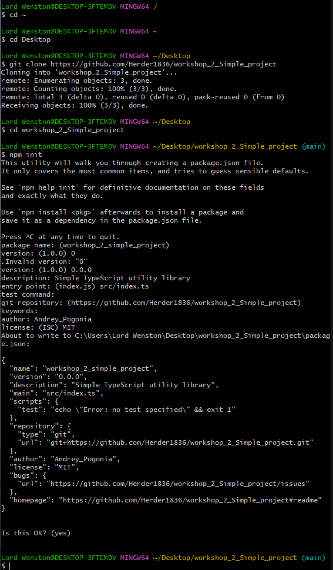
 </p>

  <p align="center">
  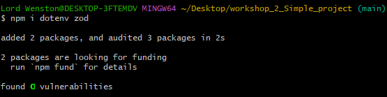
 </p>

  <p align="center">
  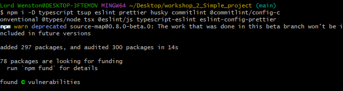
 </p>

  <p align="center">
  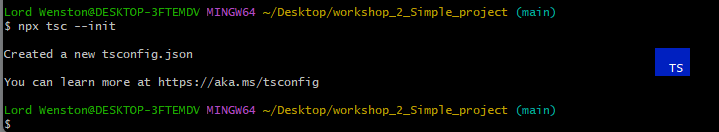
 </p>

  <p align="center">
  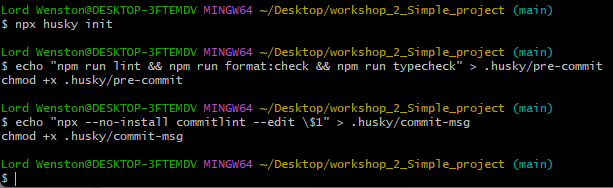
 </p>

  <p align="center">
  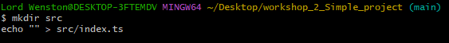
 </p>

  <p align="center">
  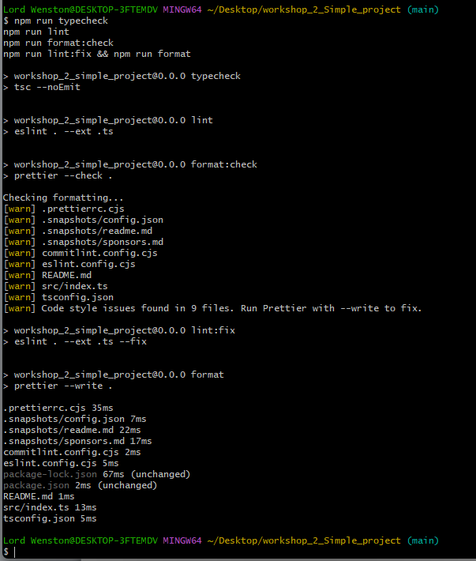
 </p>

---

2. ✅ v0.1.0

<p align="center">
  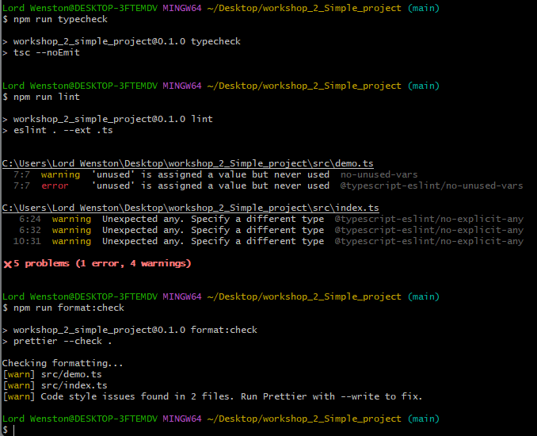
 </p>

  <p align="center">
  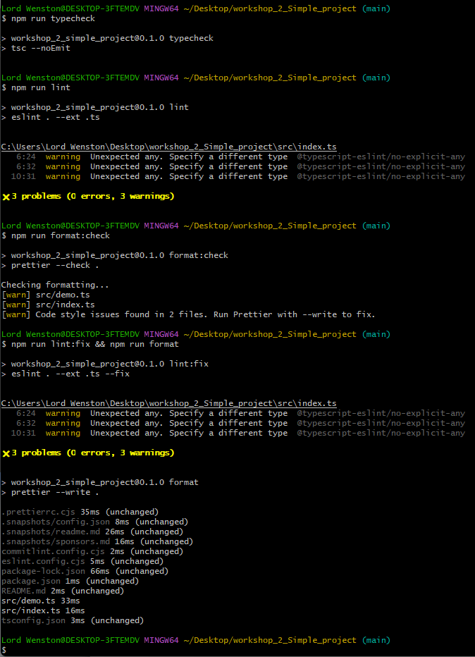
 </p>

  <p align="center">
  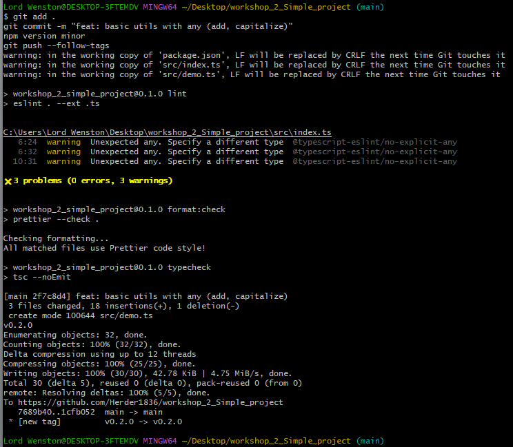
 </p>

---

3. ✅ v0.2.0

<p align="center">
  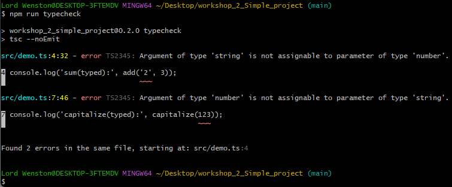
 </p>

  <p align="center">
  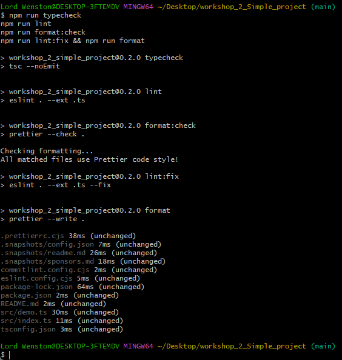
 </p>

  <p align="center">
  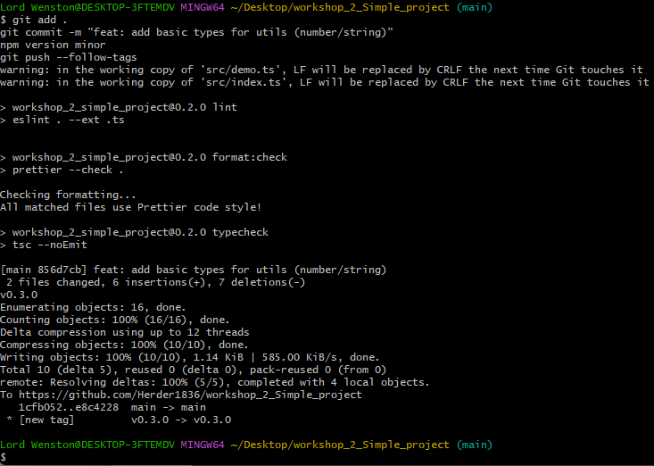
 </p>

---

4. ✅ v0.3.0

<p align="center">
  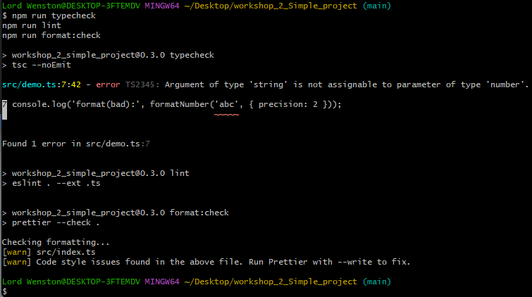
 </p>

  <p align="center">
  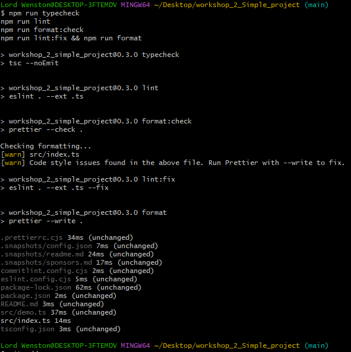
 </p>

  <p align="center">
  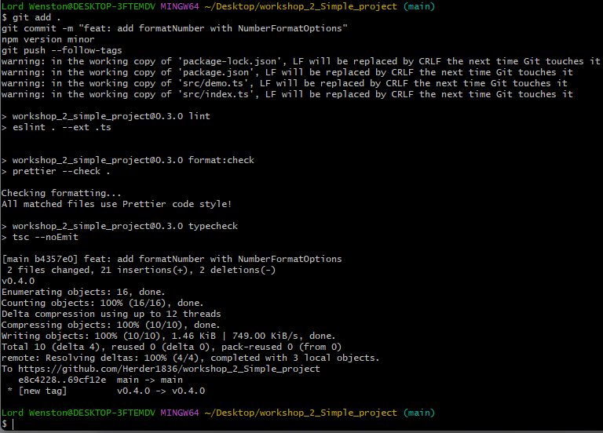
 </p>

---

5. ✅ v0.4.0

<p align="center">
  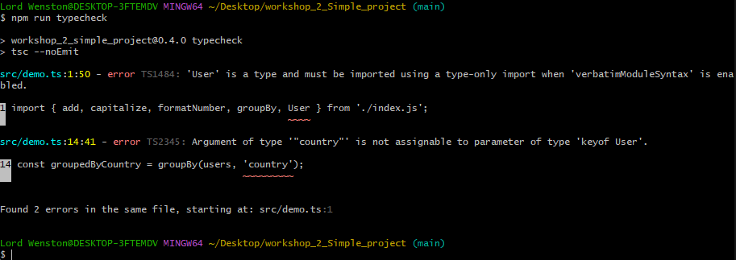
 </p>

  <p align="center">
  
 </p>

---

6. ✅ v0.5.0

<p align="center">
  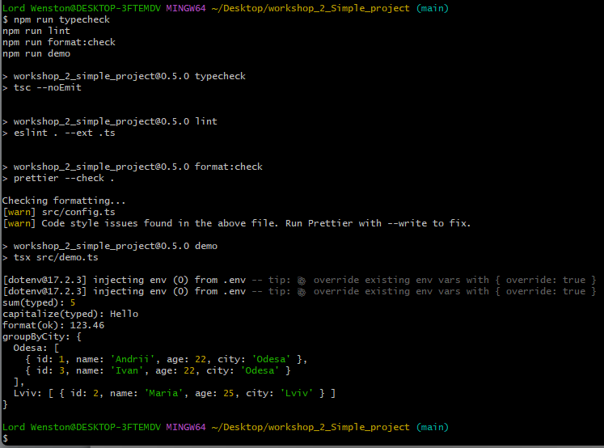
 </p>

  <p align="center">
  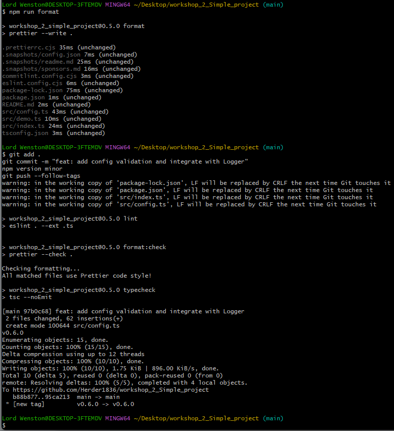
 </p>

---

7. ✅ v1.0.0

<p align="center">
  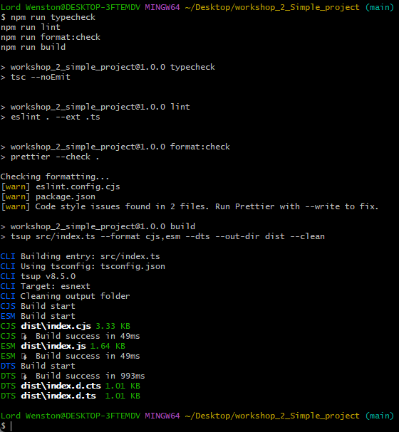
 </p>

  <p align="center">
  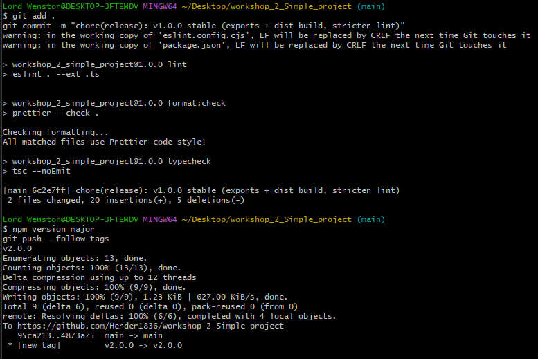
 </p>

---

8. ✅ v2.0.0

<p align="center">
  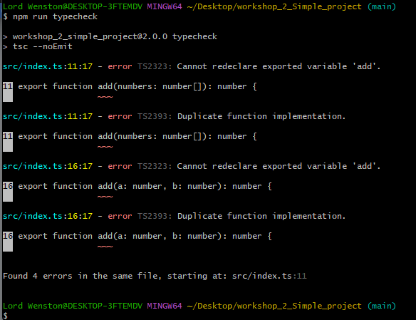
 </p>

  <p align="center">
  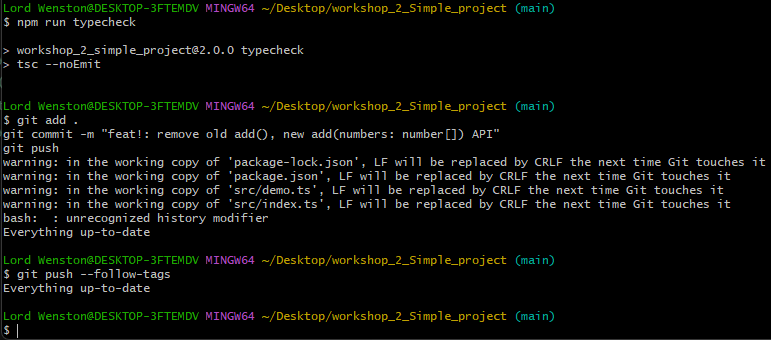
 </p>

---
